# Tic Tac Toe Game

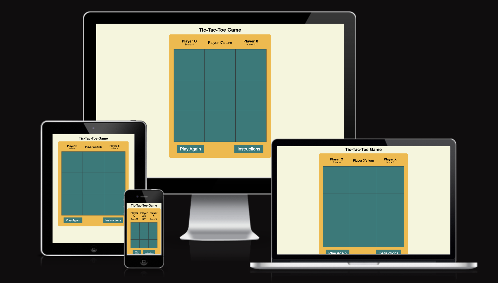

## Project Overview
This is a web-based Tic-Tac-Toe game designed for two players X and O, featuring a clean and responsive design. Players alternate between placing X and O on a 3x3 grid, with the game determining the winner based on standard Tic-Tac-Toe rules. The game also includes a scoreboard, player turn indicator, and a play again option. Additionally, there’s a custom 404 error page for handling non-existent pages.

## Table of Contents
- [Features](#features)
- [User Experience](#user-experience)
- [User Stories](#user-stories)
- [Color Scheme](#color-scheme)
- [Typography](#typography)
- [Wireframe](#wireframe)
- [How to Play](#how-to-play)
- [Technologies Used](#technologies-used)
- [Framework Libraries Tools Used](#framework-libraries-tools-used)
- [Testing](#testing)
- [Responsive Design](#responsive-design)
- [Future Enhancements](#future-enhancements)
- [Browser Compatibility](#browser-compatibility)
- [Future Enhancements](#future-enhancements)
- [Deployment](#deployment)
- [Credit](#credit)
- [Acknowledgments](#acknowledgments)

## Features
- **Two-player game**: Because it is a two player game,they alternates turns between themselves.It clearly indicates whose turn it is on the board

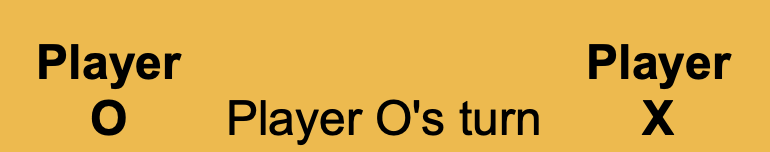

- **Header**: The header which is boldy written contains the of the website.

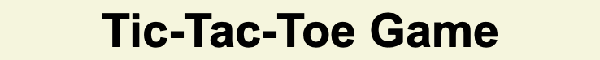

- **Scoreboard**: This tracks each player’s score throughout multiple rounds respectively.

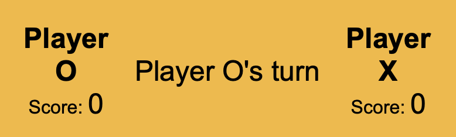

- **Win and Draw Detection**: In this part, it declares the winner when a player gets three marks in a row (horizontally, vertically, or diagonally), or announces a draw when the board is full.

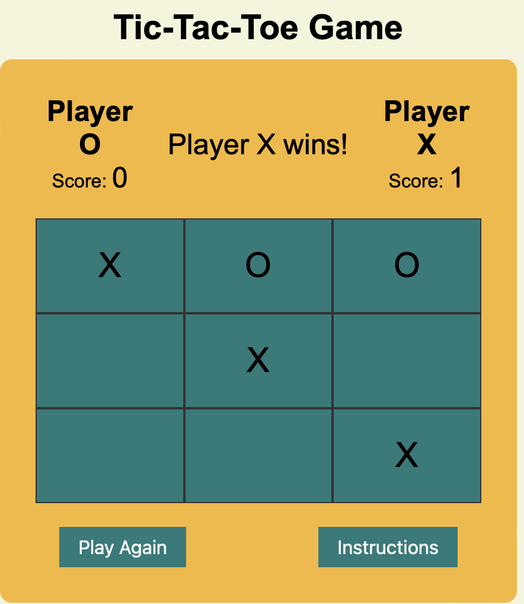

Reference image when a draw is achieved

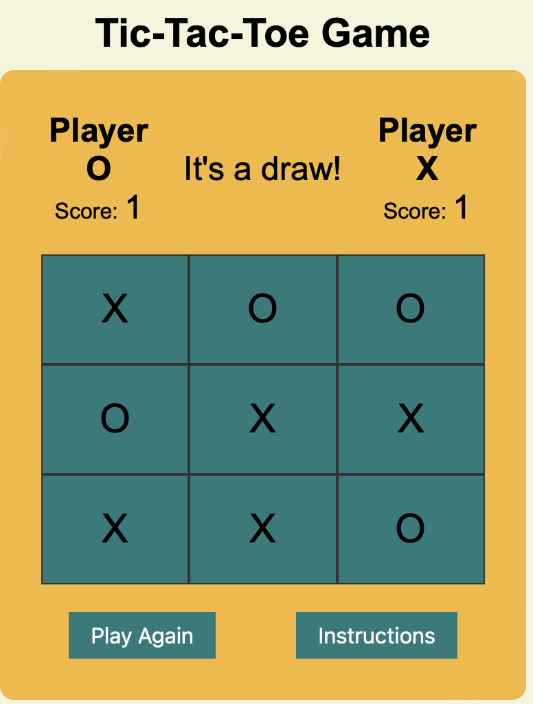

- **Play Again**: The play again button allows players to reset the board and start a new game without resetting the scores. 

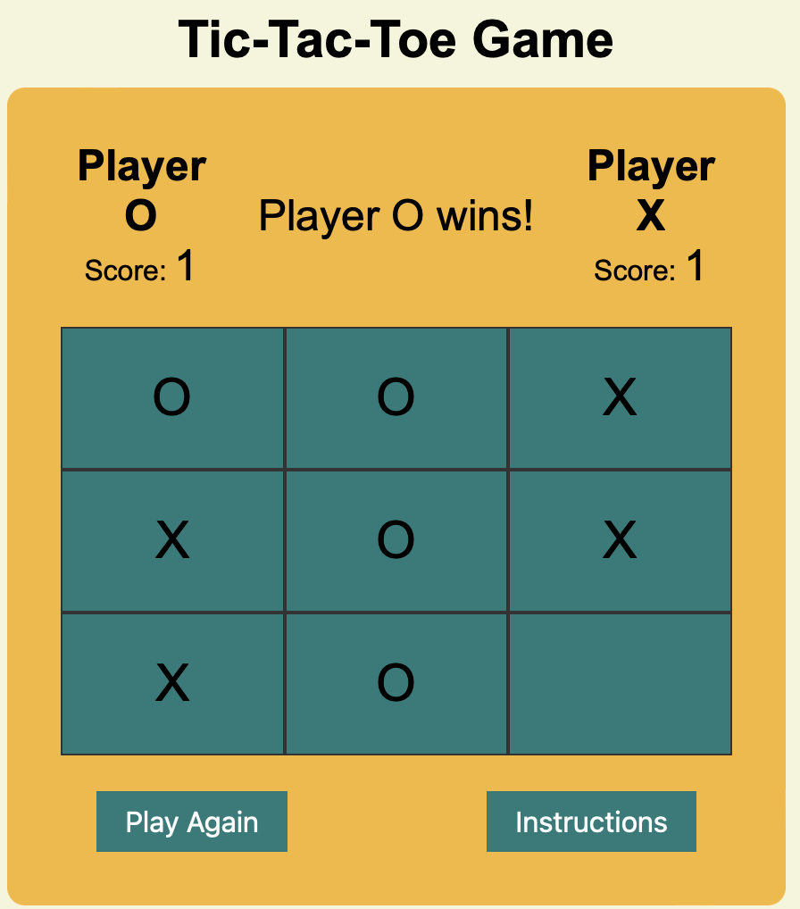

- **404  Error Page**: If a user attempts to visit a non-existent page on the site, they will be directed to a custom 404 error page that includes a friendly message and a link to return to the home page.To test the 404 page, navigate to any incorrect URL (e.g., /non-existent-page).You will be redirected to the 404.html page.

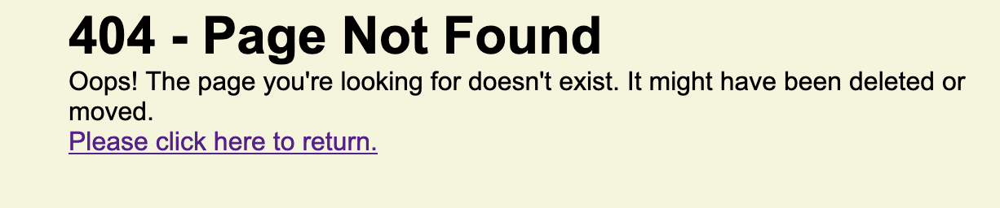

- **Favicon**: A custom favicon has been included to enhance the game's branding. The favicon file is located in the /assets/favicon/ folder.

## User Experience
 * The game is designed to provide an intuitive and engaging user experience, with a clean layout and clear instructions. The game board is large and responsive, ensuring that players can easily click on the cells on both desktop,laptops,ipads and mobile devices. The current player's turn is displayed prominently, along with real-time score updates. An "Instructions" popup is available for new users making the game more engage and flexible to use.

## User Stories
 * As a new player,i want to see clear instructions for the game,so I can understand how to play before starting.

 * As Player X or Player O,i want to see whose turn it is clearly displayed,so i know when it’s my turn to make a move.

 * As a user,i want the game to declare a winner and    update the score automatically and immediately so I can see results right after the game ends.

 * As a user,i want to be able to restart the game at any time,so I can quickly start over if i make a mistake.

 * As a  User,i want the game layout to adjust to my screen size,so i can comfortably play the game on any device i want.

 * As a Player,i want to be notified of a draw,so i know when neither player has won.

 * As a user,i want a simple, accessible scoreboard,
so I can easily keep track of my score against my opponent.

## Color Scheme 

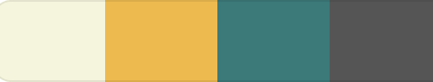

 * Color: Beige (#F5F5DC). The beige color is used as the background for the entire page, creating a warm and inviting look. 

 * Color: Light yellow (#eb4). The  game-box area has a light yellow background, which helps distinguish it as the primary interactive area. 
Scoreboard, player o,x and player's turn section inherits the game-box, #eb4 background color as well.

 * Color: Teal green (#397979) is used for the game board with a medium gray (#555) background when hovered to signal interactivity, making it clear when a cell is clickable.

 * Color: Teal Green (#397979) here is used again for play again,instructions and close button with a dark gray(#333) background when hovered while the Popup Instructions Box uses the beige color as the background color.

## Typography

 * The font family used for this project is **Arial, sans-serif**, which is known for its readability and modern feel.
 * Sans-serif is used as a fallback in case Arial isn’t available on the user's device.

 ## Wireframes

                                                    
 |  Page       |             Mobile  Version        |         Desktop Version
 |-------------|------------------------------------|--------------------------------
 |  Home       |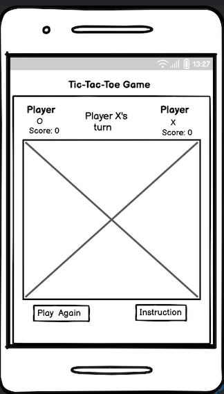|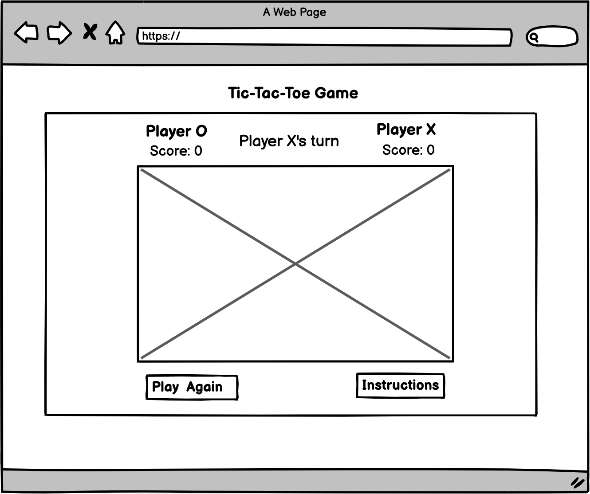
 |             |                                    |
 |             |                                    |
 |             |                                    |
 |Instructions |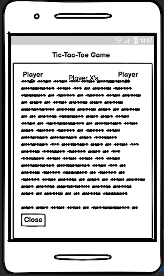|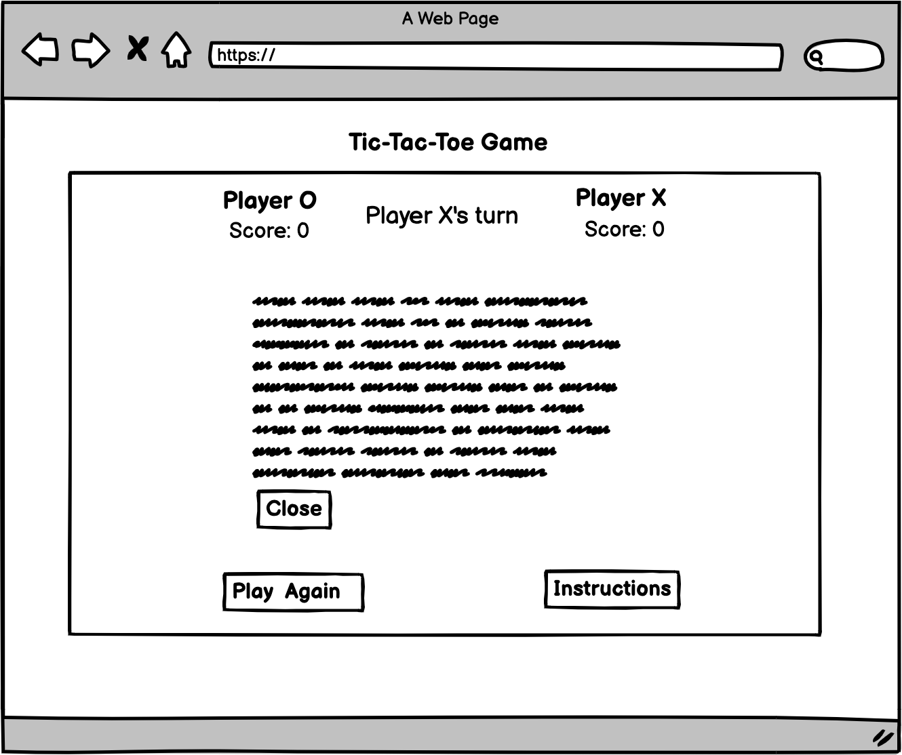
 |             |                                    |
 |             |                                    |
 |             |                                    |
 | Page 404    |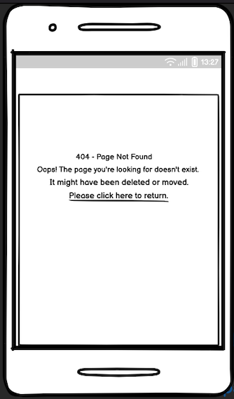|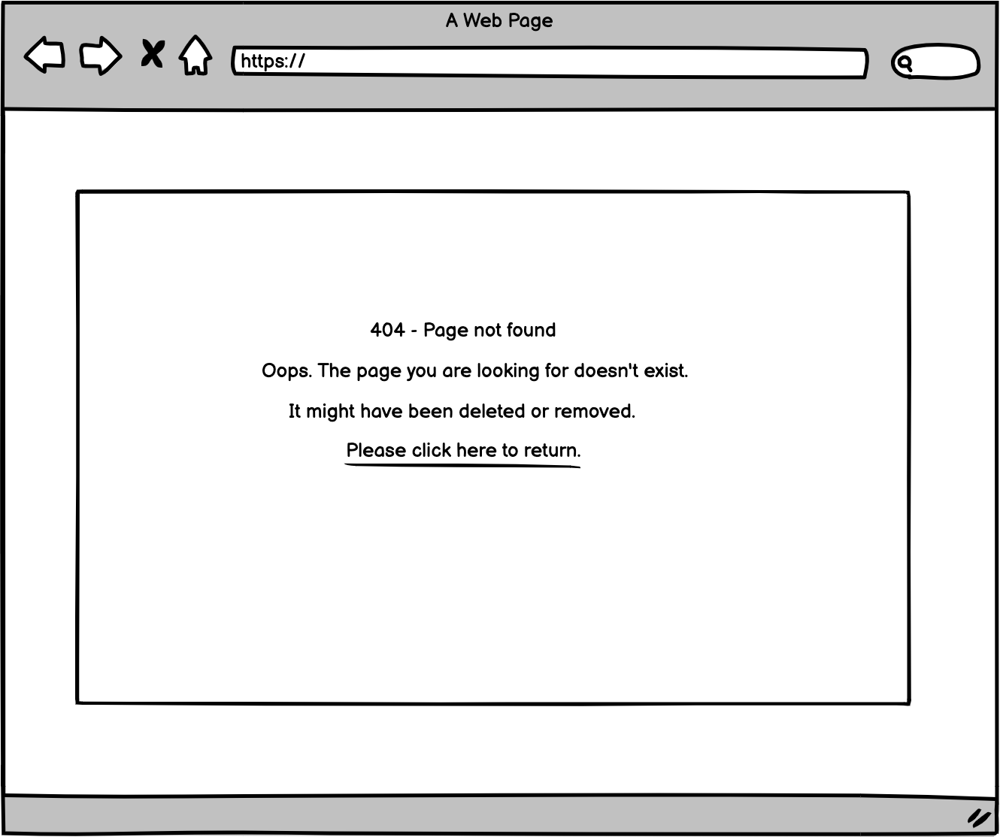
 |             |                                    |
 

[Back to Top](#)

## How To Play (Instructions)
 * When the instruction button is clicked, the how to play pops up.
 The game begins with Player o.Players take turns clicking on empty squares to place their marks (X or O).The first player to get three of their marks in a row (horizontally, vertically, or diagonally) wins the round.If all squares are filled and no player has three in a row and vise versa, the game declares a draw.To start a new round, click the "Play Again" button. The scores remain, but the board resets for a new game to start.Players can keep track of their scores using the scoreboard above the game board. This section can be closed by using the **close button** below at the left corner.

 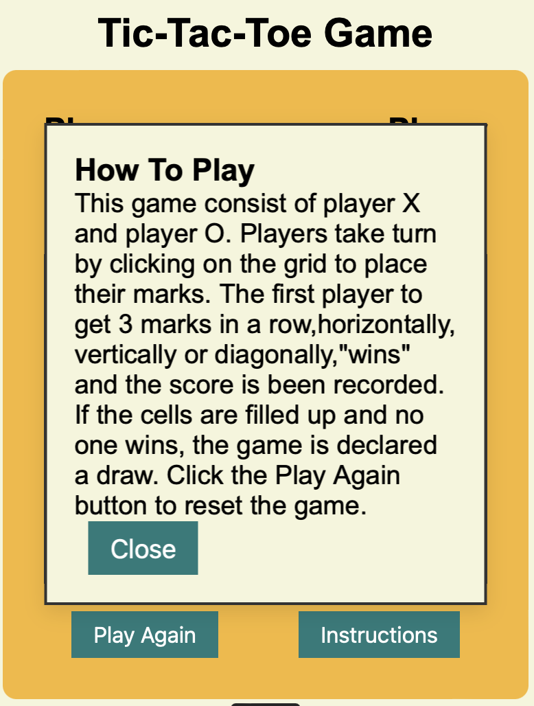

## Technologies Used

- **HTML5**: For structuring the content of the game.
- **CSS3**: For styling the layout and making the game responsive across devices.
- **JavaScript (ES6)**: For game logic, including turn-based play, score tracking, and result declaration.

## Frameworks, Libraries, and Tools Used

* This project leverages various technologies, programs, and validation tools to ensure functionality, style, and accessibility. Below are lists of the main tools used:

* [Favicon Generator](https://favicon.io/): It was used to created a custom favicon for the application, enhancing brand identity and easy browser tab recognition.

* [W3C HTML Validator](https://validator.w3.org/): Used to check the HTML code for syntax errors, ensuring proper HTML structure and compatibility across browsers.
* [W3C CSS Validator](https://jigsaw.w3.org/css-validator/): Evaluates the CSS code, checking for errors in syntax, property usage, and compatibility with standards.
* [WAVE (Web Accessibility Evaluation Tool)](https://wave.webaim.org/): Evaluates web accessibility, ensuring the project meets web content accessibility guidelines.
* [Am I Responsive](http://ami.responsivedesign.is/): Used to preview how the project appears on different device sizes, ensuring responsiveness across various screens.
* [Chrome DevTools](https://developer.chrome.com/docs/devtools/): It was used to test responsiveness and  accessibility.
* [JSHint](https://jshint.com/): It was used to validate  JavaScript code.
* [Gitpod](https://gitpod.io) : This was used for writting codes, commit and then pushed to Github.
* [GitHub](https://github.com) : It was used to store the project after pushing.

[Back to Top](#) 

## Testing User Stories

|User Story| Acceptance Criteria|    Test Case        |    Expected Result
|----------|--------------------|---------------------|--------------------     
|1.Start a |-Game board is      |-Open the game.check |-All cells are empty.     
|new game  |empty at the start  |if all cells are     |            
|          |                    |empty.               | 
|          |                    |                     |
|2.See     |-Display shows which|-Open the game,      |-Display shows 
|player    |player's turn it is.|confirm the initial  |correct player
| turn     |                    |display shows player |turn.
|          |                    |x's turn.            |
|          |                    |                     |
|3.Display |-Player scores      |-Play and win games  |-Scores update 
| score    |are visible.it      |as player x and o.   |accurately.
|          |updates after each  |Check if each players|
|          |game.               |scores increase  as  |
|          |                    |the play.            |
|          |                    |                     |
|4.Play    |-Button is visible  |-When clicked,it     |-It resets the 
| again    |and clickable.      |reset the board to   |game board.
|          |                    |empty.               |
|          |                    |                     |
|5.How to  |-Insruction button  |-When clicked, it    |When clicked pops up
|Play      |is visible and      |displays how to      |how to play,close
|          |clickable.          |play.Close button    |button functional.
|          |                    |visible and clickable|

